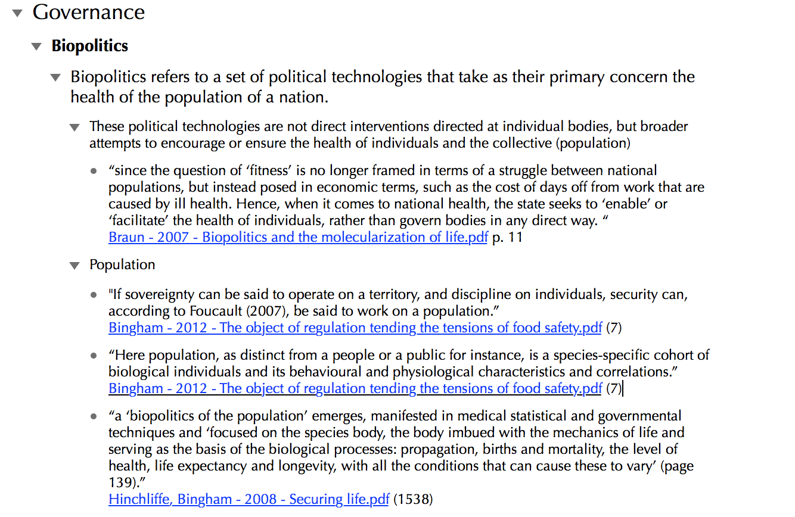
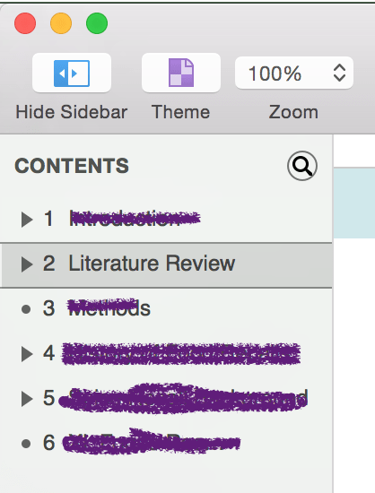

In this entry I talk about how I use [OmniOutliner](https://www.omnigroup.com/omnioutliner/) and [DEVONthink Pro Office](http://devontechnologies.com) to summarize academic literature to lay the foundation for a literature review (or any type of written work, for that matter).

## Setting Up DEVONthink {#settingupdevonthink}

To begin I need to explain a little bit about how I organize my academic literature. All of my academic literature is roughly organized into folders for broad subjects and which are stored in Dropbox. This is primarily in order to give reasonably convenient mobile access to these files in the event I want to read them on my iPad ([PDF Expert 5](https://readdle.com/products/pdfexpert5) is my PDF reader of choice on my iOS devices). I can set a given folder to be available offline in PDF Expert, avoiding having to keep my multi-gigabyte PDF library on my iPad.

I then set DEVONthink on my Mac to &#8220;index&#8221; the root directory that contains all of these subject folders and their contents. In DEVONthink parlance, to &#8220;index&#8221; is in contrast to &#8220;importing&#8221;. _Importing_ into DEVONthink means that files are kept in special DEVONthink databases that are not readily readable outside of DEVONthink, and so works well if you don't need regular, easy access to these files on outside of DEVONthink ([DEVONthink Server](https://player.vimeo.com/video/49445176?title=0&byline=0&portrait=0&autoplay=0), included as part of the Pro Office version, however, could work for some use cases though). _Indexing_, on the other hand, allows you to reference files as they live in your computer's file system. This means I can have my PDFs in folders in Dropbox, and still view them in DEVONthink and take advantage of various organizational and search features in DEVONthink. So in DEVONthink, I end up with a listing of all those subject matter directories and their PDF contents:





From here I can use tags to impose a more elaborate and in my opinion, useful, organizational system on these that doesn't mess too much with their organization in Finder (and thus, does not impact their accessibility on my iOS devices!). I'll write more about this in another entry, but just to demonstrate, here is a segment of my tag list in DEVONthink. This is my primary way of organizing in DEVONthink and offers much more flexibility than the rough folder categories I described above (again, that is almost solely inservice of offering easy access on my iOS devices). Example of my sloppy tagging to the right.

## Setting up OmniOutliner {#settingupomnioutliner}

This is a much less sophisticated task compared to DEVONthink. If you aren't already familiar with OmniOutliner, familiarize yourself with its features and its functions. Now, you don't have to use OmniOutliner in particular for this task, but I do find it to be one of the most intuitive and powerful outlining applications. Using a text editor or word processor for outlining has, in my experience, made what is an essential part of writing into an onerous task. OmniOutliner makes it a breeze. If you have a favoured outlining application of your choice you'll likely be able to translate some of these ideas into that system (and likely have an effective system of your own). Once you're familiar with OmniOutliner pick a template or create a template that suits your writing needs. I've built my custom template for outlining paper and literature reviews which I'll link to, but its no major chore to make your own.

## The workflow {#theworkflow}

Now that we have our files in DEVONthink I'll outline the workflow. Essentially the purpose of this workflow is to create a single document with paraphrased passages and quotes, with direct links back to the original document for future reference (and proper bibliographic reference when I finally write it up). The idea is that by the time I'm done in OmniOutliner, I should be able to take the paraphrased passages, incorporate any of the extracted quotes that are essential, and transfer them to my word processor to generate a more-or-less complete literature review to stand on its own for my reference, or to plunk into a manuscript. Once it is in the word processor it should only require some polishing/fleshing out, and proper bibliographic references (I use [Papers 3](http://papersapp.com) as my reference manager currently, though its been a long road with lots of reference manager casualties along the way. This subject deserves its own post).

### Step by step {#stepbystep}

  1. Open your PDF in DEVONthink's PDF viewer. It is somewhat important that you read using this viewer rather than in Preview for reasons that will become apparent shortly.
  2. As you encounter important passages select them and copy their contents to your computer's clipboard.
  3. Move to OmniOutliner. At this point I do one of two things depending on what I'm working on. I'll either write a passage paraphrasing the quote I've copied which will eventually serve as the actual contents of the literature review, or I'll write a keyword or concept that the quote pertains to. I usually do the former when I'm at a more advanced stage of writing, while I'll do the latter when I'm making a literature review simply for my own reference or in the earlier stages of writing.
  4. Create a new outline item and press tab to make it a child of the paraphrased text you just wrote. Then &#8220;paste and match style&#8221; (shift-opt-cmd-v) to make sure the content matches the formatting of your OmniOutliner template.
  5. Wrap the text in quotation marks and fix any nasty line-breaks and hyphenated words if you're nit-picky like me.
  6. Return to your PDF in DEVONthink, copy the page link for the page you are currently viewing (shift-ctrl-opt-cmd-c).
  7. Return to your outline, add the link as a &#8220;note&#8221; for the quote you just pasted (cmd-&#8216;) with the page number in parentheses for your reference.

<figure>
  
  <figcaption class="post-img-cap">
    Early stages, not much paraphrased content in this example, but it should convey the idea
  </figcaption>
</figure>

At this point you should end up with something that looks more or less like the image on the right.

The major advantage of using OmniOutliner for this task is the ability to easily move things around. During the course of my reviewing, I'll change the order of things, create new sections, combine previously separate sections, and so on. Using a regular text editor or word processor for this task can be a bit painful once you start having copy/paste or drag errors, lose your hierarchy and so on as you clumsily shuffle things about. These are total non-issues in OmniOutliner.

Repeat this process until you're satisfied and feel ready to create the formal literature review in the word processor of your choice. Take some time to use OmniOutliners organizing capabilities to your advantage here. Make sure you have all of your things in the order you want them to appear in your final document. It's much easier to move these things around in OmniOutliner than it is in your word processor.

If you've been diligent with your paraphrasing, if you've made sure to use page links for every quote and paraphrase, and you've used the easy drag-and-drop organizing to make sure things are in a logical and sensible order, this part should be easy. You should, with little effort, be able to dump your paraphrased stuff (through exporting or copy and pasting) into your word processor, adding the references with your reference manager as you go along, incorporating quotes where needed. You should now have a reasonably well organized, fully-referenced not-totally-rough draft of your literature review. Obviously at this point there is still work to do to make it publication-ready, but you've done a lot of the hard work already.

## Additional notes {#additionalnotes}

I generally keep my OmniOutliner-created files around forever since they are great reference material. It is also easy to copy-and-paste nodes or entire trees into other OmniOutliner documents if I'm in need of it in another OmniOutliner document. You might be asking why I put the Page Links into a &#8220;note&#8221; for each node. Having them as a &#8220;note&#8221; has two important benefits: First, it ensure that the link and the quoted passage are inseparable, so you never end up with orphan quotes. The second benefit is that notes can easily be hidden and shown, individually or en masse. This helps clear up the clutter and improve the readability of the outline.

<figure>
  
  <figcaption class="post-img-cap">
    The &#8220;Contents&#8221; pane in OmniOutliner allows you to focus on one particular section.
  </figcaption>
</figure>

You could also use OmniOultiner as a means of outlining an entire manuscript, making the literature review section just one portion of the broader outline. You can then use the &#8220;Content&#8221; pane in OmniOutliner to show only the literature review section as I've done in the image to the left.

You might also be thinking that this is a lot of clicking and switching between applications. Indeed it is, but once you really build the keyboard shortcuts into your muscle memory and get the hang of using cmd-tab to switch between applications, you'll find that you can get a quote and page link into OmniOutliner quickly and with minimal effort.

I hope this post inspires you to think about how you review your research literature and that maybe it will help you with your own workflow. I had been using DEVONthink for a while now, but it was OmniOutliner that really revolutionized how I digest my academic literature. The two work together so well when using &#8220;Item Links&#8221; and &#8220;Page Links&#8221; that I hardly know how I go by without them!
