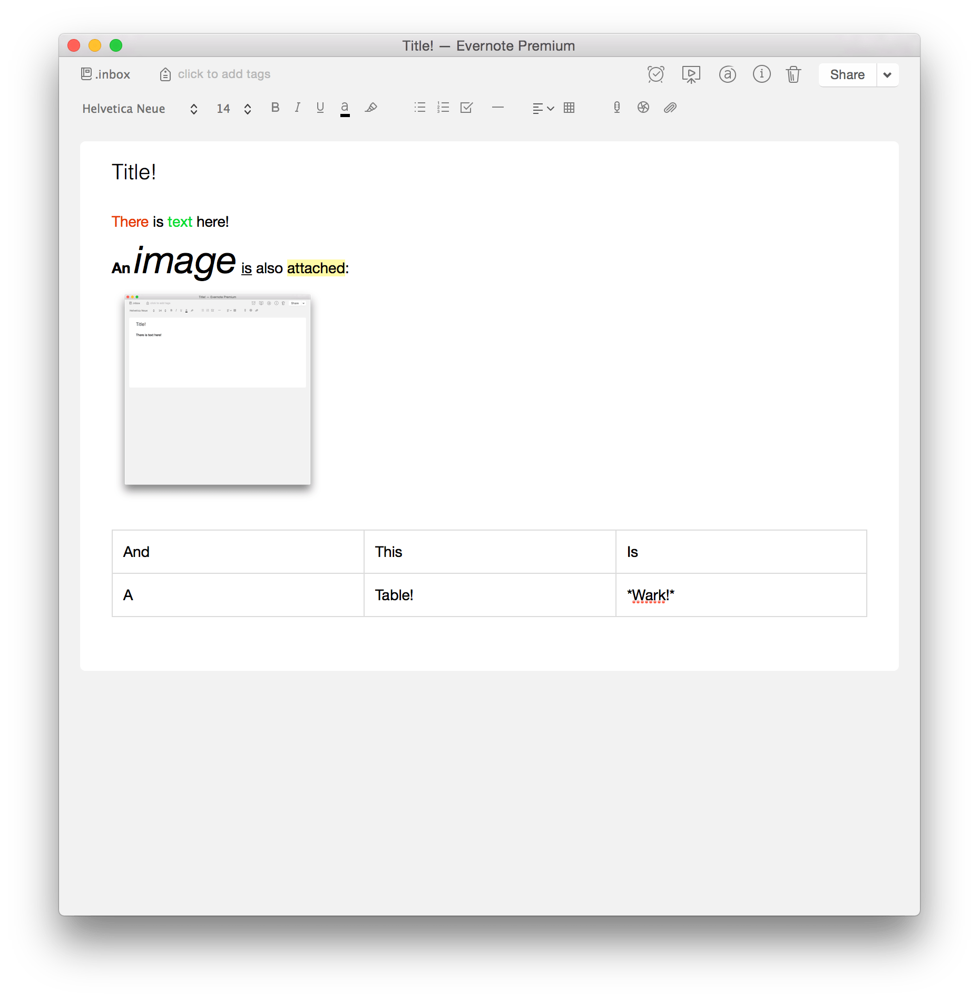
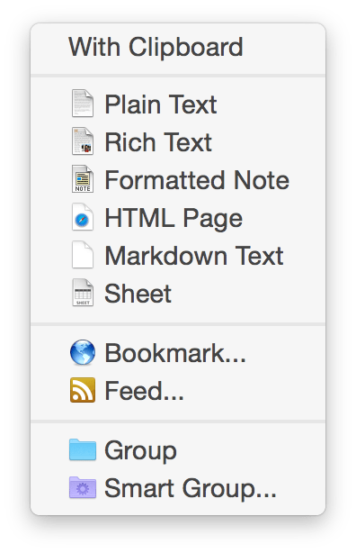
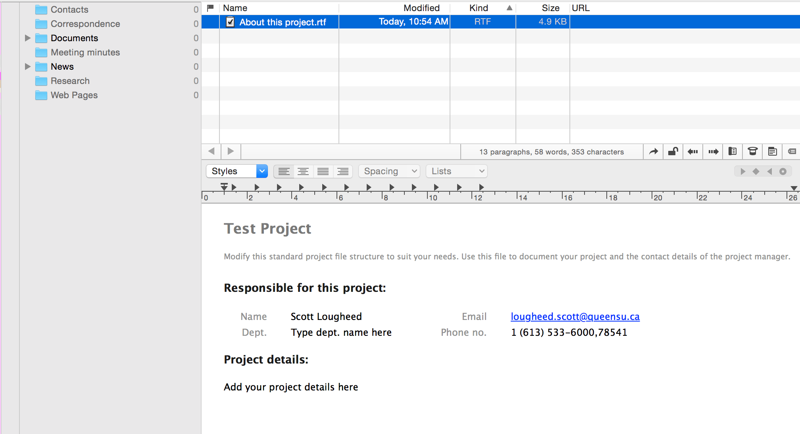
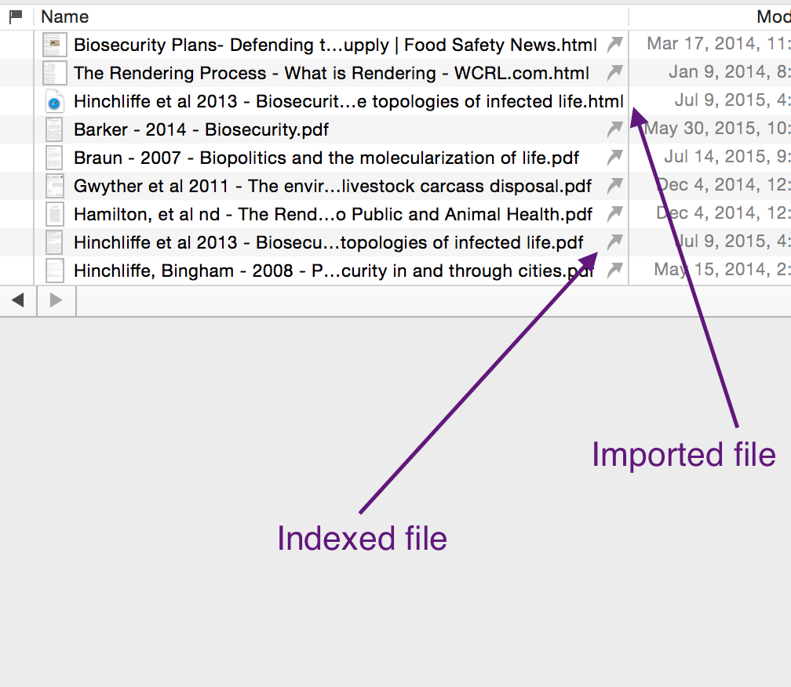
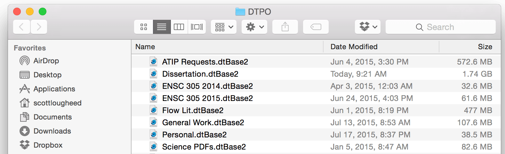

I suspect a quick Google search will show a few thousand results comparing Evernote and DEVONthink intended to help you decide which _one_ to use. However, I think it is important to explore the differences between these applications not for the purposes of choosing one _over_ the other, but for understanding the different needs that each application offers. It is not an either/or situation. I chose these two applications because they are very frequently referred together or suggested as alternatives to one another. However, they are not alternatives, they are not replacements, they are different products with different purposes and uses. And while I've chosen to compare these two, there are plenty of other options, [Microsoft's OneNote](http://www.onenote.com) and [Google's Keep](https://keep.google.com) are two prime examples of options that are also along the lines of Evernote (and less like DEVONthink), as you shall quickly see.

I originally set out to write an elaborate post that described how I use both applications, with the hopes that such an explanation would reveal the differences and similarities between the two applications. That quickly proved cumbersome. Instead, I have produced a pair of short DEVONthink/Evernote posts instead. The two posts highlight some salient differences between DEVONthink and Evernote. The posts are formatted as pairs of contrasting sentences with elaborations below, focusing on a short list of key areas chosen off the top of my head (so not at all systematic or exhaustive). These posts are not instructive, I'm assuming you either have existing knowledge or are willing to look up how to do these things in the documentation.

Part I focuses on some critical functional differences with some important implications. Part II focuses on features that are largely shared between the two applications but which are implemented in different ways.

### Evernote allows you to create one type of document {#evernoteallowsyoutocreateonetypeofdocument}

<figure>
  
</figure>

Evernote allows you to create &#8220;Notes&#8221;. Notes are documents that contain formatted text, tables, images, and links. On the surface they look similar to a rich text file (under the hood, they are written in ENML which is largely HTML). You can also attach files of any type (except for a few _gotchas_, like .pages files) that can be opened in a suitable external application. Evernote notes and the (not entirely) basic formatting they offer are great, low-fuss ways to get ideas down quickly. You can actually generate some fairly nice looking documents very quickly in Evernote using their native Note format.

I rarely actually create Evernote notes with the intention of adding text. In most cases I am attaching files for storage and retrieval. Most notes I do make are quick jottings, such as the weight of each of my cats. Heavy-duty writing is done in Microsoft Word (yes, yes, I know), and depending on the project, is indexed by DEVONthink (more on that below).

### DEVONthink allows you to create multiple document types {#devonthinkallowsyoutocreatemultipledocumenttypes}

<figure>
  
</figure>

DEVONthink can natively create a variety of documents. These include plain and rich text, markdown, basic spreadsheets, and even HTML documents that it can display as the source code or render as a web page. These can all be viewed and edited right in DEVONthink. There are also a number of advanced &#8220;templates&#8221; that come with DEVONthink, and you can make your own. For example, some default templates include a Cornell note document, a contact card with a link to that card in your Address book, or a blank task list you can add to. The &#8220;Project&#8221; template shows off the power of templates in DEVONthink the best. As you can see from the screenshot, it creates a master &#8220;About this project&#8221; file and automatically generates sub-directories for various project elements that you can populate with your own project files as you being your planning.
<figure>
  
</figure>
Above is a more advanced "template" in DEVONthink. This is the pre-installed "Project" template. You can see the pre-generated file structure to the right, ready to be filled in. DEVONthink is not so much about easily creating pretty looking notes natively, though between HTML, Markdown, and Rich Text, you can do a fair bit natively. What lacks in its native ability to create pretty looking documents, it makes up for in its ability to handle almost any type of file you could possible need access to.

### Evernote handles files as &#8220;attachments&#8221; to notes {#evernotehandlesfilesasattachmentstonotes}

If you want to store an arbitrary file in Evernote, such as an image, PDF, Word document, and so on, you have to first create a Note, then attach the desired file. Attachments can only be accessed via Evernote and cannot be stored or easily accessed from the Finder or opened via the suitable app. If you attach a word document to a note, for example, you cannot open that document from the Finder or Word, you _must_ open it from Evernote. This can cause some grief if you have an attachment open, close Evernote, and make further edits to the attachment. Because Evernote is no longer running it will not sync the changes to the server, and it is possible though rare, that if you make a mis-step here to lose data. A very crude analogy would be to think of Evernote notes as email messages with attachments.

### DEVONthink can handle any files type on its own {#devonthinkcanhandleanyfilestypeonitsown}

You can add any file you like to DEVONthink. It will display a wide variety of files natively, allow viewing of an even wider variety of files beyond what can be edited in DEVONthink itself. Any file that cannot be edited or viewed in DEVONthink will open in the appropriate external application. A contrasting crude analogy would be to think of DEVONthink as a file system, where files stand on their own, rather than email messages with attachments.

### Evernote defaults to synchronizing your content {#evernotedefaultstosynchronizingyourcontent}

Evernote is, in some respects, a cloud _service_ with a robust client (i.e. the application you have running on your Mac), rather than a _product_. Much of what makes Evernote great is done server side (making images of text searchable, for example). As a result of this, Evernote works best if you synchronize your stuff, which is the default state for everything in Evernote.

You can create &#8220;local notebooks&#8221; which, as the name implies are only stored locally. This can be good for some sensitive information but I don't trust this system. It seems all too easy to uninstall your Evernote client (say, when troubleshooting or setting up a new machine) and lose local data, because you failed to export it prior to uninstalling. It is also possible to accidentally place sensitive information into a synchronized notebook or to have your local notebook actually accidentally uploaded to servers (and there have been reports to corroborate my suspicion of both of these happening). In either case you've either lost important data, or uploaded sensitive data to places you shouldn't upload to. Neither of these are risks I'm interested in taking.

The synchronization in Evernote is great. It is so straightforward and works so well (most of the time). One major perk is it makes sharing simple. My partner and I share a few notebooks. For example, we have a &#8220;household&#8221; notebook containing all the documents related to our household affairs, such as receipts for joint purchases, financial planning, vacation planning, and things related to our cats (we recently kept a photo journal of a minor ailment afflicting one of our cats. Being able to both contribute to that journal daily without fuss was truly amazing). We also share a notebook with recipes for cooking. It is easy to scan printed recipes or clip them using the web clipper and have them immediately accessible on our iOS devices in the kitchen or do quick searches for &#8220;rhubarb&#8221; or &#8220;Cookie&#8221; (we use tags to assist with this too) if we need inspiration or ideas. All of this is so easy and is fueled by Evernote's synching.

Synchronization is less great when in comes to very sensitive information. Because of this, there is a lot of information I do not, or cannot store, in Evernote (and I do not like the opacity and unreliability of Local Notebooks).

### DEVONthink does not synchronize content to any cloud by default (or at all) {#devonthinkdoesnotsynchronizecontenttoanycloudbydefaultoratall}

DEVONthink's synchronization capabilities are more diverse and flexible than Evernote's but they are a bit less straightforward. DEVONthink doesn't, as yet, offer any seamless synchronization, and does not offer its own cloud service a la Evernote. The major disadvantage is that it makes sharing or collaborating as I described doing with Evernote impossible, or at least nearly so nearly so. DEVONthink _does_ provide a system for synchronizing databases directly between two macs, and this can be facilitated with a service like Dropbox, directly over your LAN, or via your own webDAV server. It is great if you have a home and work machine, or a desktop and laptop. <s data-preserve-html-node="true">It does not aid in collaboration</s>. Collaborating with DEVONthink's sync options can be done, and the folks at DEVONtech outline one way of collaborating with DEVONthink and Dropbox on the [Devonian Times blog](http://blog.devontechnologies.com/2015/04/tuesday-tip-use-dropbox-to-sync-with-friends/).

The major advantage to having files stored locally is that I always know where they are all the time. There are no sync conflicts. There are no errors. Most importantly for me, I have full control over my data. My research data has personal information about third-parties. My university prohibits me from storing that in cloud services (with a few small exceptions, and Evernote is not one of them). The province of Ontario also has legal limitations on this. It is therefore important for me to have large portions of my research data explicitly _NOT_ in the cloud. Thankfully all of the amazing features DEVONthink offers take place locally, so this is not an issue for me.

### Evernote maintains its own, cryptic database to store your content {#evernotemaintainsitsowncrypticdatabasetostoreyourcontent}

Evernote stores your data in you computer's ~/Library/Containers directory, and it is in a database format that is pretty human-hostile. You can get into it, you can view files, but it is organized in a way that makes zero sense to a human. It was not built for you to wade into. Besides, if you mess with the database in the Finder, you risk corrupting it, potentially losing data, and so on. This means you have to always do everything via Evernote's interface. This is not itself an issue. Evernote has its little data silo and you modify the contents of that silo through the Evernote interface. Everything only ever lives in that silo.

A major consequence of this is you cannot &#8220;reference&#8221; files. That is, files only ever live in Evernote's database. Evernote cannot see things outside of this database, and you can only view the contents of the database through Evernote. You cannot, for example, have an Word document that is stored in your ~/Dropbox folder attached to an Evernote note.

Another consequence is that editing attachments after Evernote has closed can be problematic. As mentioned above, modifying an attachment after Evernote has been closed can potentially result in data loss since Evernote loses track of what is current or what has changed.

### DEVONthink can store content in a database or reference files in your file system where they lay, or both {#devonthinkcanstorecontentinadatabaseorreferencefilesinyourfilesystemwheretheylayorboth}

DEVONthink has its own databases, not unlike Evernote, however there are some important differences. The first is that files you organize using DEVONthink don't actually have to be stored in these proprietary databases. You can &#8220;import&#8221; files, or &#8220;index&#8221; files, or both. Files you &#8220;import&#8221; into DEVONthink live in these silos along with all of the extra metadata that DEVONthink generates about these files to fuel its &#8220;artificial intelligence&#8221; engine that helps your organize and find files. If you &#8220;index&#8221; files or directories, the files remain where they lay in your file system (so, if you index a folder in Dropbox, the files live in that dropbox folder), while all the additional metadata that DEVONthink needs live in its own database. Changes made to files in that directory inside or outside of DEVONthink are automatically reflected both inside and outside of DEVONthink.
<figure>
  
</figure>

For example, in the image above you see a list of PDF files. These PDFs live in a folder in Dropbox, but are indexed by DEVONthink, and thus, available through the sophisticated search features and for processing by DEVONthink's "AI". These files have little arrows next to them indicating that they are &#8220;indexed&#8221;. These files don't live in DEVONthink, they actually live in a folder in Dropbox. I can use DEVONthink to read and annotate these files and they remain in Dropbox, and all the changes are immediately reflected in Finder and Dropbox. This is exactly the same as if I had just opened the PDF in Preview.app and made changes there. Likewise, if I read and annotate one of these PDFs on my iPad, the changes are synced via Dropbox and immediately reflected in DEVONthink. This allows me to take advantage of all of the searching and organizational features in DEVONthink, without rendering my PDFs inaccessible from other devices. Imported files live in DEVONthink's databases and need to be accessed via DEVONthink, though they can be opened, viewed, and edited, in any external application you like, even if DEVONthink is closed while you have a file open in an external application. Unlike Evernote, there's no harm in modifying files that are imported into or indexed by DEVONthink after DEVONthink has closed since there is no threat of a sync conflict.

### Evernote Maintains a single database, stored in a hidden location {#evernotemaintainsasingledatabasestoredinahiddenlocation}

The major downside here is that this is also where your local notebooks live, which makes them very difficult to move around between machines if you are setting up a new Mac for example. You have to go through a slightly onerous export-import routine&#8230; and that assumes you remember to export and backup your local notebooks before you nuke your previous installation! You can also only have one Evernote database. This means that you cannot have, say, a &#8220;Work&#8221; and a &#8220;Home&#8221; database. While you can use Notebooks and Stacks to differentiate these things, it is not always ideal and can clutter searches. If you want full separation, you need separate Evernote accounts. This can mean that, once you accumulate a lot of stuff, it's an all-or-nothing deal and extremely large Evernote databases can sometimes be slow. And while Evernote's searching functionality is robust, it can be hard to add all of the exclusions needed to ensure you don't have a lot of work cruft when searching for a recipe for dinner.

### DEVONthink allows you to create any number of databases, stored where you see fit, and which are portable {#devonthinkallowsyoutocreateanynumberofdatabasesstoredwhereyouseefitandwhichareportable}

With DEVONthink, I can create any number of databases. This can help mitigate slow-downs due to large databases (you can split databases at logical points), and isolates contexts making sure searches are focused and that the AI that helps categorize or surface related content is bringing up meaningfully related items.

I don't need my receipt for DEVONthink to come up as a search result or as a &#8220;See Also&#8221; suggestion when I'm looking for academic literature. Having my personal files in a separate database means that I don't have to string together a slew of exclusions in my search terms, nor do I have to sift through false positives.

<figure>
  
</figure>

These databases also live in any location. I store them in ~/Documents/DTPO. I can move them to a new location if I want with zero consequence. It's also trivial to move items _between_ databases should the need arise, such as if you want to split a database that is getting too large or if something suddenly shifts contexts. Another advantage: I don't need my multi-gigabyte academic literature or government document databases open when I just need to quickly consult my comparatively small personal database. This means the application loads quickly and requires fewer computer resources when all I have is a small job.

One advantage of this is that, while you cannot restore parts of databases easily (as was also the case with Evernote), restoring entire databases, or multiple versions of entire databases from backups is very easy. This means, and unlike with Evernote, you can restore one or more versions of a database from a backup. You can also have these restored versions open _simultaneously_. This means if you are trying to find a past version of a single file, you can have your current database open, along with a past version, and transfer only that file from the backup to the live database. Put another way, backups are much easier with DEVONthink's system, and so is restoring.

That's it for Part I. [Part II](http://www.scottlougheed.com/blog/2015/7/19/devonthink-vs-evernote-part-ii) will be posted in a few days. Stay tuned, and try not to let the suspense get to you in the meantime.
