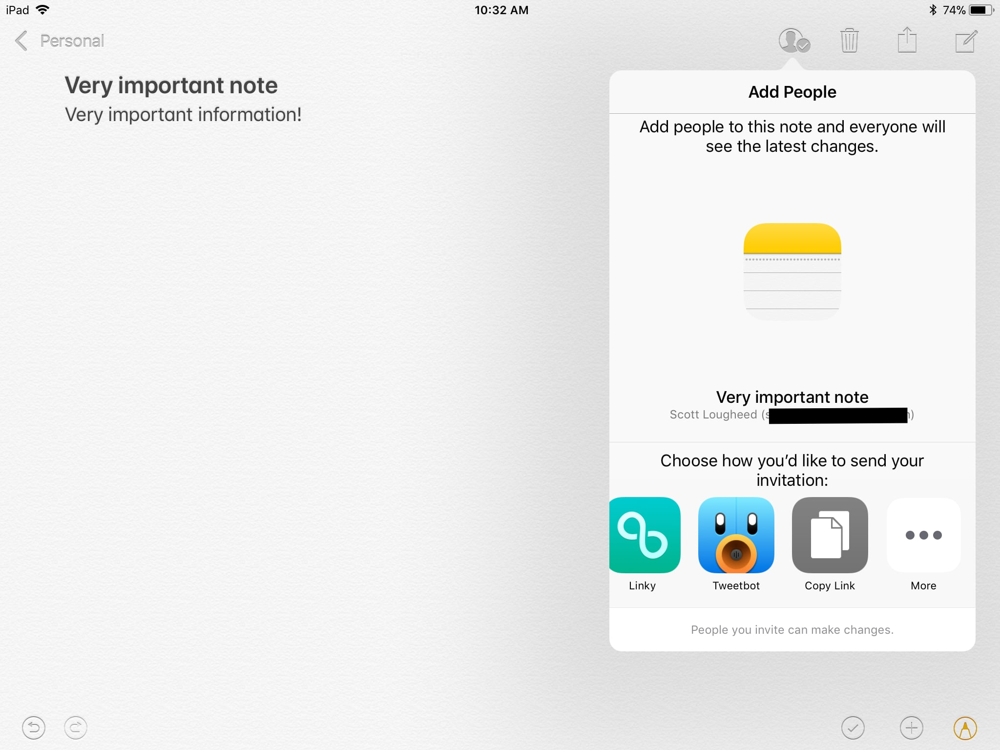
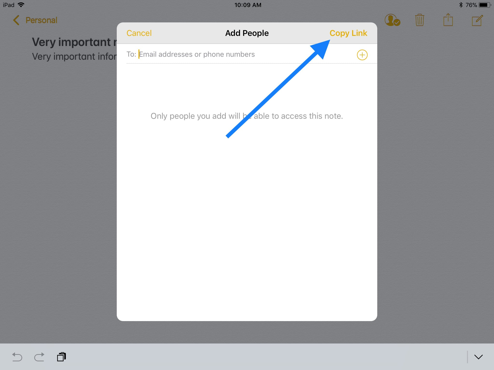

Recently, I’ve been increasing the amount of information I keep in Apple’s Notes application, which received a significant feature update [in iOS 9](https://www.macstories.net/stories/ios-9-review/8/#notes). One thing I struggled with, however, was finding an easy way to surface needed information in Notes at a specific time.

I don’t like to store reference data in my task manager or calendar because the information in those applications is, by definition, transient, and a lot of the material I need to reference to perform those tasks is not. [DEVONthink](http://www.devontechnologies.com/products/devonthink/overview.html) (and [DEVONthink To Go](https://itunes.apple.com/us/app/devonthink-to-go/id395722470?mt=8)), my information manager of choice, very easily creates links to anything you store inside of it. You can paste these links anywhere on iOS and macOS and they will be clickable and take you directly to the desired file. Very handy. I frequently paste these links into OmniFocus tasks or calendar events so I don’t have to manually browse for the information by digging through countless folders.

But with more and more of my information going into Notes instead of DEVONthink, and as an adherent to the mantra that you *never keep your reference materials in your task manager*, I was a bit frustrated that I had to manually browse the Notes app to surface information I might need for a given task.

As it turns out, you can exploit the collaboration features introduced to Notes in iOS 9 to mimic DEVONthink’s file linking.

Open the note you would like to link to and tap the Add Person icon.

You’ll be provided with a standard iOS share sheet. Locate the “Copy Link” action in the bottom row and tap it.

At this point you’re prompted to enter an email address or phone number of a potential collaborators.[^1] Since we’re collaborating with ourselves today, you can just tap Copy Link in the top right to copy the link to your clipboard and dismiss the share sheet.

Now you can easily paste this link into the Notes section of your task manager of choice, or the URL section of a calendar event, or anywhere else you please. Clicking on this link will take you straight to the note so you don’t have to do any time-consuming digging and browsing.

If you are interested in taking things a few steps further, Federico Viticci at MacStories has a great writeup on [how he uses Notes on iOS](https://www.macstories.net/ios/ipad-diaries-optimizing-apple-notes/).

[^1]: Which seems odd, since this is the same prompt you get if you select to share by Messages or Email, so I don’t see why you should also see it when using the generic Copy Link action!
