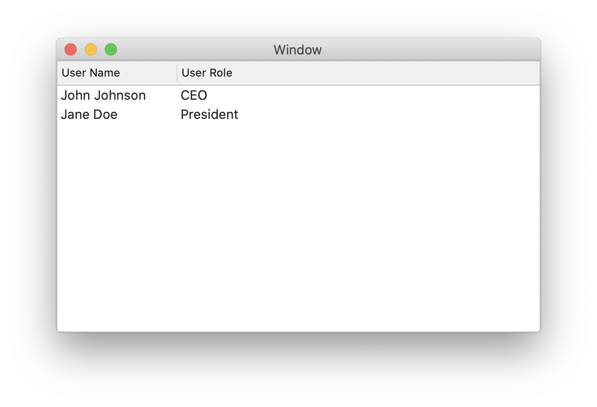
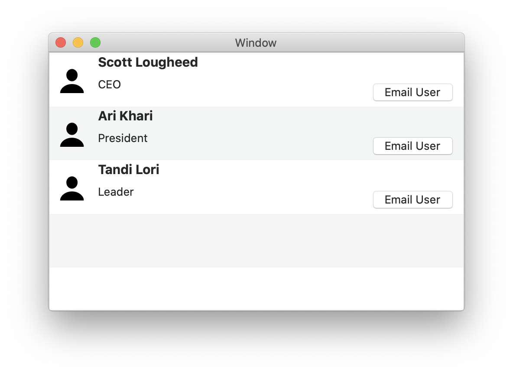
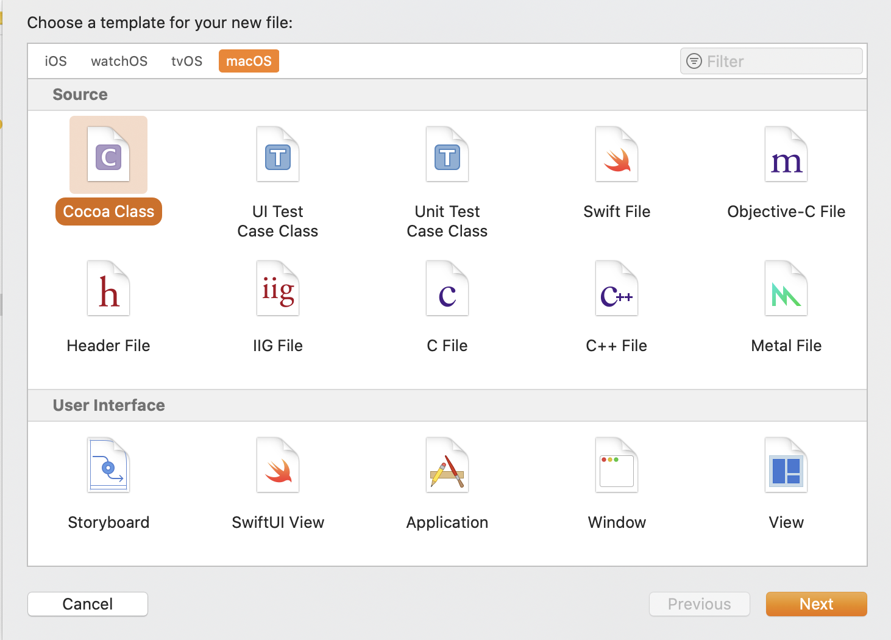
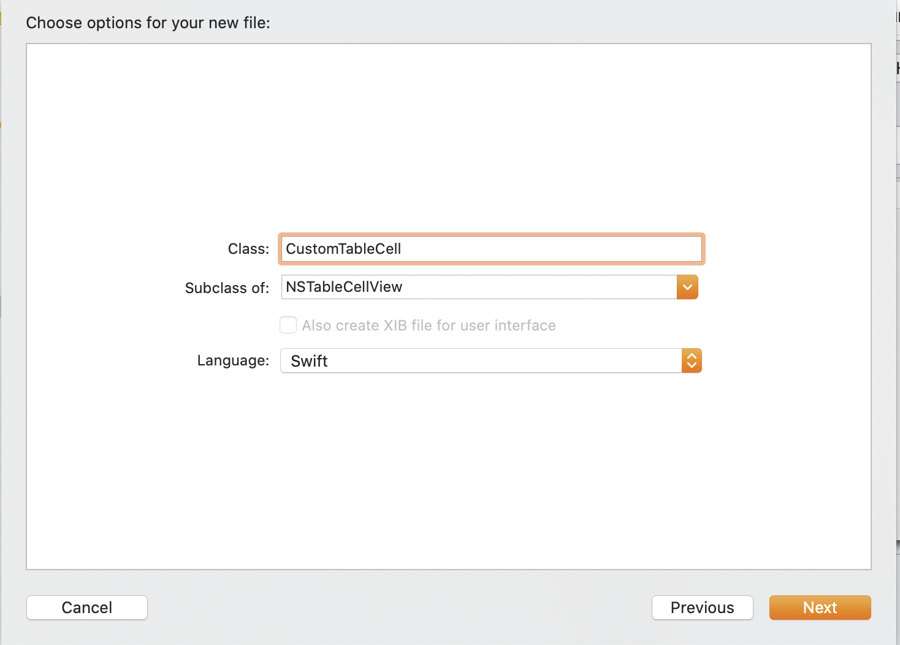
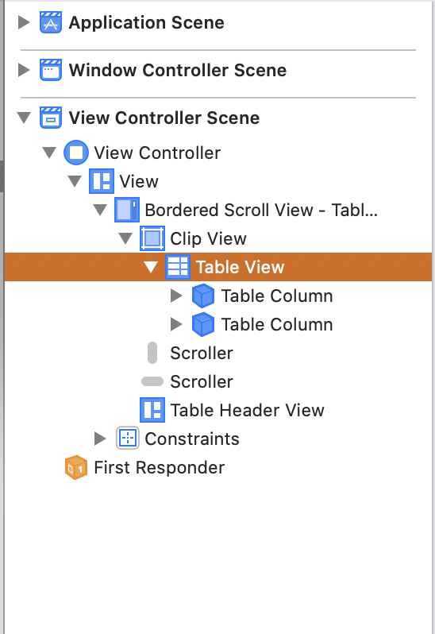
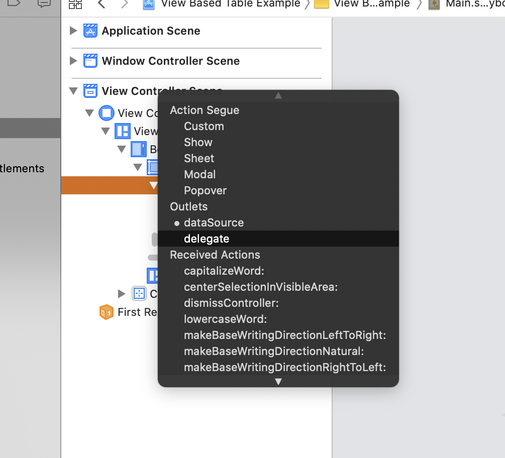
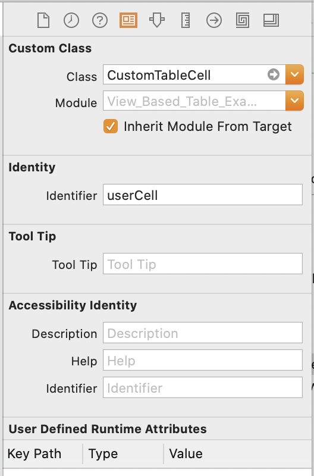
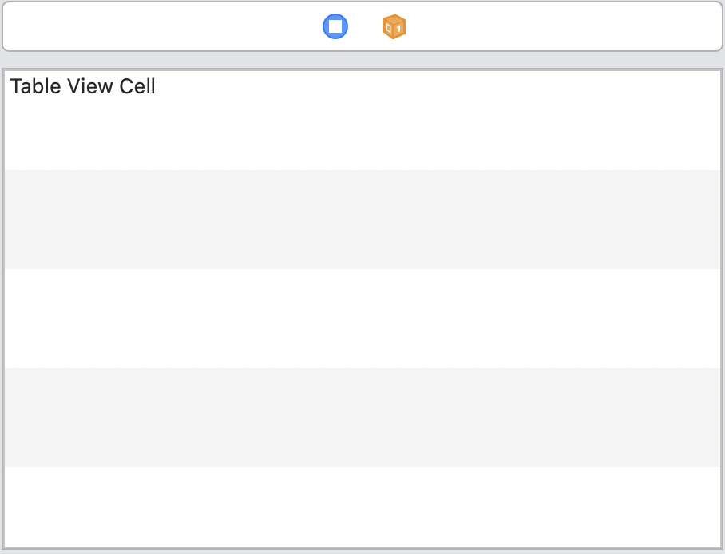
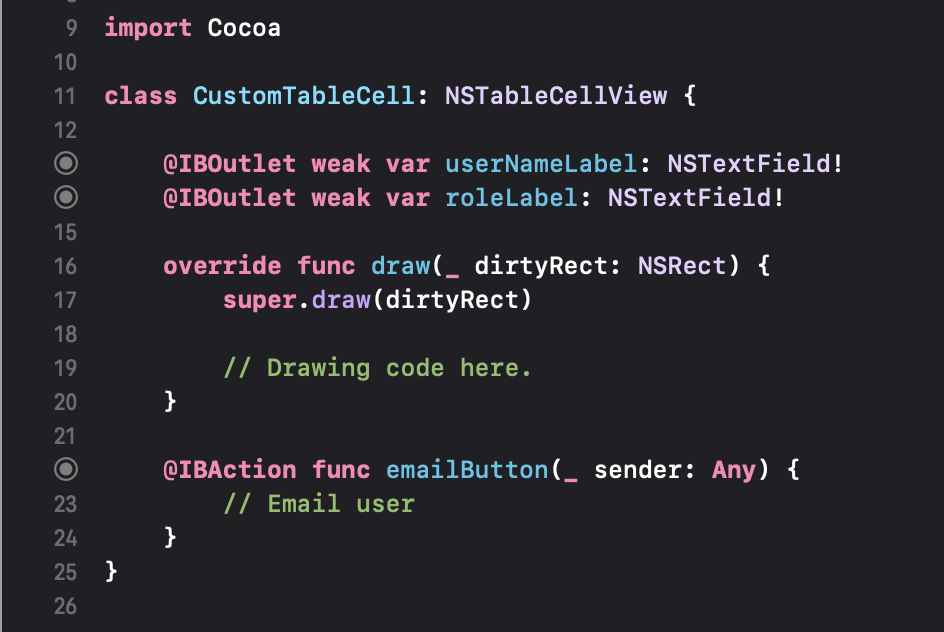

I'm currently working on a small Mac menu-bar based application for myself. I wanted to present information in an `NSTableView`, but the standard cell-based row cell offered by `NSTableView` on macOS didn't offer me enough flexibility for my needs. The basic cell-based `NSTableView` looks similar to this:


This is a super clear and useful way to display lots of data in a sortable table. For my project I needed something a bit more aesthetically pleasing for use in a context where there would always be a fixed number of table cells in a fixed order.

I needed to display multiple, differently-sized and formatted `NSLabels` and `NSImages`. View-based `NSTableViews` are perfect for this, allowing for something like this crude example:


On iOS this is accomplished by creating static cells, which is not only fairly straightforward, but also the subject of dozens of reasonably current tutorials and Stack Overflow posts.

Accomplishing this in AppKit is not nearly as straightforward (a truism), and all but one of the examples I could find online were around a decade old and written in Objective-C (also a truism about Mac development). There was a single example (the link to which I have since lost, and it is hard to find!) in Swift, albeit in Swift 3, since which time there have been numerous changes to the Swift language and to how Interface Builder works in Xcode.

Nevertheless, between the lone Swift example and a few ancient Objective-C examples I was able to get it sorted out and create a custom view-based NSTableView. My struggle inspired me to write an updated tutorial on the process in Swift 5.

A note: I am a very novice programmer and am self-taught. As such, my approach may be clumsy and at times downright wrong. I'm happy to receive knowledgable and kind feedback so I can improve the tutorial.

To begin, open a new Swift language project for macOS in Xcode. I'll walk us through the process to build the custom table of users in the image above.

## Creating Our Classes

Let's start by creating the necessary classes and any additional files we might need.

### ViewController()

First we need to have our `ViewController()` class conform to `NSTableViewDelegate` and `NSTableViewDataSource`.

Let's also make a property of our `ViewController()` class containing some data to display. We'll use a dictionary here with `name` and `role` keys.

```swift
let users = [["name":"Scott Lougheed", "role":"CEO"], ["name":"Ari Khari", "role":"President"], ["name":"Tandi Lori", "role":"Leader"]]
```

### CustomTableCell()

Now add a new Cocoa class file.



Name the file CustomTableCell (obviously this could be whatever you like for your own project) and make it a subclass of NSTableCellView.


We don't need to do anything with this file yet, to let's move on to our interface.

## Building the Interface

### Setting up the table

Switch to Main.storyboard and add a Table View to the existing view. Resize the Table View to fill the entire area. For this example we only want one column that will span the entire table width.

In the Document Outline, select the Table View (make sure you haven't accidentally selected the Bordered Scroll View or any other superviews).



In the Table View's Attributes Inspector:

- Make sure Content Mode is set to View Based and the number of columns is set to 1 and uncheck the "Headers" option.
- Whether we want them or not, I like to enable "Alternating Rows" while I'm working on layout in Interface Builder because it's easier to see the hight of each row and the position of elements within, so go ahead and check that box while we're here. We can always un-check this after laying out our cell if we prefer.

While we have our Table View selected:

- ctrl-drag from the Table View in the Document Outline to View Controller and set the View Controller as the Table View's Delegate and Data Source.



Finally, select the size inspector for the Table and set the Row Size Style to Custom and the row height to 60.

Back in the Document Outline, select the Table Cell View. In the Identity Inspector:

- Set the Class to our previously-created CustomTableCell class.
- Set the Identifier to userCell so we can address it from our ViewController class.


Select the Size Inspector:

- Set the Height to 60. This won't impact the interface at build time but does make the row in Interface Builder match the row height we set for the Table View, which makes placing our UI elements much easier.

We should now have a table in Interface Builder that looks roughly like this:


### Building our UI

Select the existing label that says "Table View Cell" and delete it.
From the Library (cmd-shift-L), place *as a child of the Table Cell View* an Image View, two labels, and a Push Button. You'll know you've placed these correctly if they appear as a child of the Table Cell View in the Document Outline.
Select the image:

- Set the height and width constraints to be 50.
- Set a constraint so the leading edge is be 0 points from the leading edge of the superview.
- In the Attributes Inspector, set the Image attribute to be NSUser (or whatever image you like!).

Select one of the labels:

- Set a constraint so the leading edge is 5 points from the trailing edge of the image view.
- 0 pts from the top of the superview.
- Trailing edge is 25 pts from the trailing edge of the superview.
- In the Attributes Inspector, set the title to "User Name" and the found to System Bold 15.

Select the other label and position it just below the User Name label.

- Change the title to "Role".
- Set the leading edge to align with the leading edge of the User Name label.
- Set the top edge to be 8pts from the bottom of the User Name label.

Select the push button:

- In the Attribute Inspector, set the title to "Email User"
- In the Size Inspector, set the trailing space to be 10pts from the trailing edge of the Superview and 5pts from the bottom.

Return to the Role label one last time and set a constraint of 8pts from the trailing edge of the label to the leading edge of the Email User button.

### Creating Outlets and Actions  

Using the assistant editor, create an outlet for each label (userNameLabel and roleLabel, respectively) in CustomTableCell.  Create an action for the Button, which we'll just leave as a stub. Your `CustomTableCell()` class should look like this:


For our purposes we don't need to create an outlet for the table in our View Controller but don't forget to do this if you're going to be doing anything serious with your table.

## Configuring Our TableView

Time to get back to code. Switch to your ViewController file. We need two methods in here to get our TableView up and running: `numberOfRows(in:)` and `tableView(_:viewFor:row:)`.

### numberOfRows(in:)

This method tells our tableView how many rows to create, and it's as simple as returing the size of our `users` array:

```swift
    func numberOfRows(in tableView: NSTableView) -> Int {
        return users.count
    }
```

### tableView(_:viewFor:row:)

This is a bit more elaborate, here's the code, with explanations below.

```swift
    func tableView(_ tableView: NSTableView, viewFor tableColumn: NSTableColumn?, row: Int) -> NSView? {
        guard let userCell = tableView.makeView(withIdentifier: NSUserInterfaceItemIdentifier(rawValue: "userCell"), owner: self) as? CustomTableCell else { return nil }
        
        userCell.userNameLabel.stringValue = users[row]["name"] ?? "unknown user"
        userCell.roleLabel.stringValue = users[row]["role"] ?? "unknown role"
        
        return userCell
    }
```

The first line create a new userCell and typecasts it as our CustomTableCell (if you wanted to use a standard cell, you would cast this as an NSTableCellView). You'll recall we set the Identifier of our TableCellView to "userCell". Make sure you pass `NSUserInterfaceItemIdentifier(rawValue: "userCell")` as the argument to the makeView method call. This seems like a bit of a hacky way to make things work so if you know of a way to avoid this, please get in touch! (Remember when I said I was a total novice!?)

The second and third lines seed the labels with the appropriate data from our array of users using `row` as the subscript to access each array index based on its position in the table (e.g., row 0 accesses the 0th index in the user array). We further subscript it using the dictionary key for the value we want to display.

At this point you can use the `!` operator to force unwrap these values. Even though we're all-but guaranteed to not get a `nil` back in this particular context, I've still chosen the less risky option of using the nil coalescing `??` operator to print a string in case for some reason we get `nil` back.

The final line returns the userCell to the tableView delegate.

At this point you can run your app and you should see your pretty table with your custom cells!

If you've had trouble following these directions or need to check your work please download the <a href="/files/view-based-table.zip">Xcode project files </a>.
